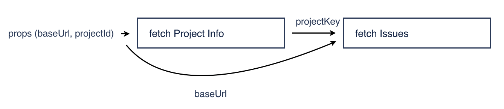
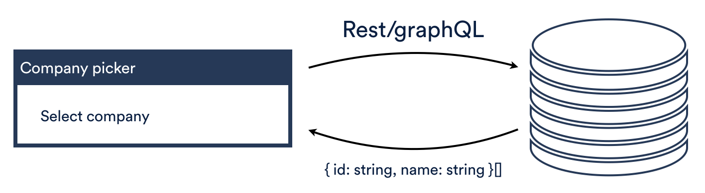
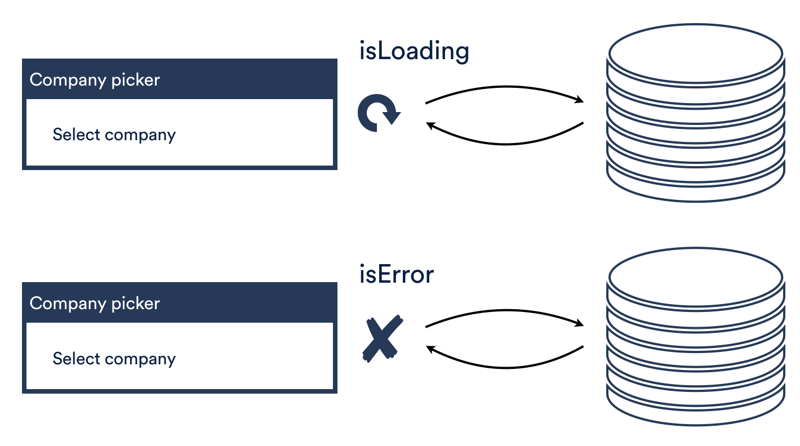
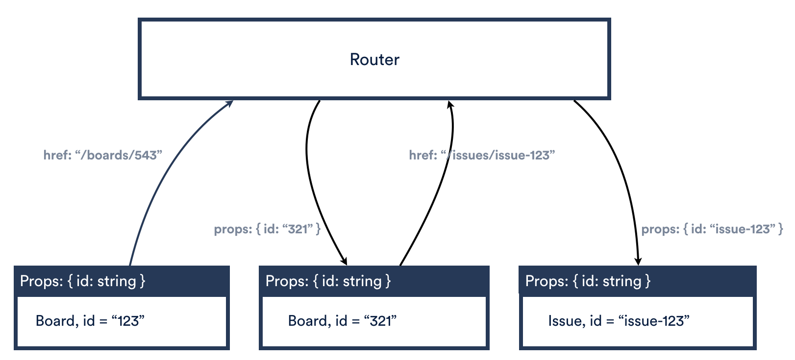
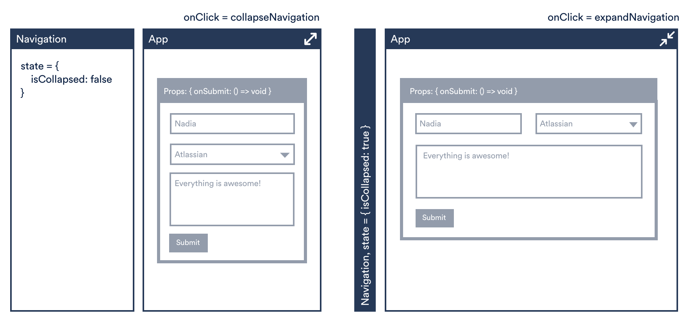
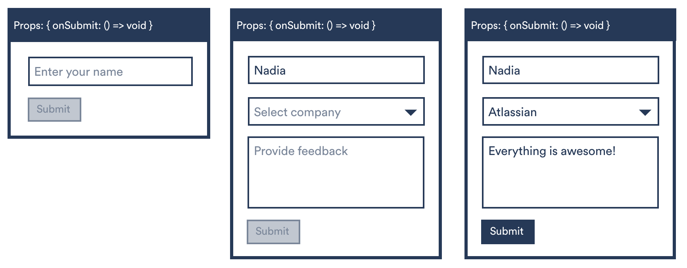
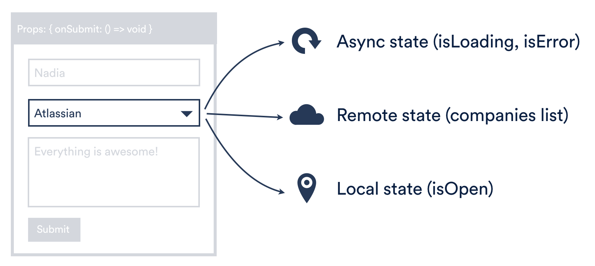
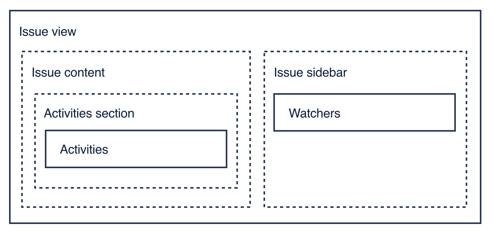

# Frontend Patterns in React

## Everything is a component

Components are the basic building blocks and primary units of code re-use in React. The most important part of this article is mindset to use components as the **“universal declarative interface”** for all aspects of React code. Everything from data fetching, state management to local storage access, data transformations is encapsulated into their own isolated pieces of functionality, that are independent and communicate with the outside world through the declarative components API.

The primary reasons for using “components for everything” approach are to:

- switch to a “decomposition-first” mindset when we write our frontend
- break down the pattern of building large and fragile monolithic structures
- increase code reuse
- align better with the current direction the industry is heading

## Composition, API bindings and render props

Encapsulation, decomposition and separation of concerns are the cornerstones of development at scale, which in the React world is basically the ability to scope things to a particular component in the hierarchy.

With the “components for everything” approach, it is vitally important to have a simple way to share data or results of operations between components. This is especially important for components that are responsible for something that in Jira was traditionally handled by Redux/Observables (like data fetching or loading/error state). One of the most powerful concepts in React for achieving that is **Render props**. You can read more about the benefit of using render props instead of traditional props API in [The Treatise On State Management](https://www.youtube.com/watch?v=tBz3UmZG_bk) as well.

What makes **render props so powerful** for this use case, is that they turn a component into a “black box” with a clear Input/Output API, that can be composed with any other “black box” in any combination.

Consider, for example, a situation when a `ProjectWithIssuesPage` needs to fetch some Project info based on the `projectId`, and then fetch a list of issues for the `projectKey` that is extracted from that Project info:



We used to isolate concerns based on their type. We would create rest/services/ops/state layers for both of those requests within the `ProjectWithIssuesPage` app, and we’d orchestrate when to show spinners and when to start another fetch via State/Ops/Observables/Redux/Sagas etc.

This quickly becomes complicated, especially when you need to orchestrate a few requests that depend on each other. Another downside: in the case when part of the logic needs to be re-used between different apps, for example fetching of `Issues`, it is impossible to extract it from the `ProjectWithIssuesPage` app without a big refactoring since all the logic that deals with this concern is scattered across multiple layers of the application.

With “components for everything” approach and **render props**, we encapsulate the specific concern (for example “manipulate Issues for a project” concern) into a Component that accepts initial props (baseUrl, projectKey) and returns data, state of this data (loading, error) and api to manipulate this data (fetch, update).

In code this approach would look something like this:

```js
<ProjectDataProvider projectId={123} baseUrl={baseUrl}>
  {({ data: project }) => (
    <IssuesDataProvider projectKey={project.key} baseUrl={baseUrl}>
      {({ data: issues, loading, error }) => {
        if (loading) {
          return <Spinner />;
        }

        if (error) {
          return <Error />;
        }
        return issues.map(issue => <IssueCard description={issue.description} name={issue.name} />);
      }}
    </IssuesDataProvider>
  )}
</ProjectDataProvider>
```

Where `ProjectDataProvider` is a component, `IssuesDataProvider` is a component, the code above is the main view of `ProjectWithIssuesPage` app and rest/services/ops/state/etc layers for it are non-existent. While both `ProjectDataProvider` and `IssuesDataProvider` initially live within `ProjectWithIssuesPage`, in case logic of any of them needs to be re-used somewhere else, all it would take is to just drag-and-drop it to a different place somewhere. No big refactorings, the only change required in the `ProjectWithIssuesPage` app would be the imports paths.

## State management: core concepts

Up until recently, we have been using Redux for most of our state management concerns. This provided us with some significant benefits, one of them being that Redux is a well-established pattern and well-understood from the community perspective. Chances are, if someone new comes to Atlassian who has experience with React, they will know Redux as well. Also, it is very formal, structured and testable, which helped a lot in creating previous guidelines and principles on structuring apps.

Despite that, Redux has its disadvantages as well.

**It is designed to own all the state.** This does not help developers to think about more granular types of state that might have different, more suitable patterns. Instead, it encourages treating of the state as a homogenous pattern, to basically implement big **monolithic** state machines instead of thinking more about **separation of concerns**. This is very similar to the situation with CSS in the "old days" when the common practice was to have a series of CSS/Less/SASS files, that contained all of the CSS selectors that were bound to the DOM elements somewhere outside. It had a decent structure, people invented good rules and architectures around it (BEM - Block Element Modifier being one of them), but also it required a lot of infrastructure to manage it, and it still was overwhelming and fundamentally hard to scale to big applications. When the patterns like **CSS modules** or **CSS-in-JS** emerged, and it became possible to collocate styles with components, they did not become just a better solution to a problem that BEM/SASS tried to solve, they changed the rules entirely and made the problem became irrelevant instead. This is essentially the goal of this page.

**It is fundamentally imperative.** Most of the state management patterns in React are trending towards being implemented in the components interface itself, which is fundamentally declarative. And one of the biggest challenges in React since it emerged was that declarative interfaces and the concept of uni-directional data flow are hard to map between imperative and declarative interfaces. Because of that, it is quite hard to delegate pieces of state to any declarative state management solution like Apollo for data fetching or React-router for router state.

**Cross-apps communication vacuum.** Current architecture treats all apps as their own state containers, where all the state management concerns are completely isolated, and all communication happens through their public interface, i.e., props API. This is a really clean architecture, and if instead of that state that all the teams work on was put into one single store, it would have been a massive scale problem. Unfortunately, it left something of a vacuum around how to deal with the state that is cross-cutting across apps or sits across multiple layers of the components hierarchy. And Redux discourages that because of its tendency to monolithic stores, difficulties to syncing it with other state management solutions, and the fact that one global Redux store is not something that is feasible for large scale applications.

Those challenges initiated the thinking on where the future of the state management is and what are the patterns that are emerging to manage those better.

## State management patterns

### Remote state

The remote state can be defined as a state that mirrors remote data set. For example, a list of issues received from the REST request, or a list of companies provided via GraphQL endpoint would be a remote state.



A good example of implementing this pattern would be Apollo and Query component that fetches a GraphQL query and exposes the result to your component so that you can render your UI based on the data it returns.

### Async state

Although async state is often conflated with the remote state, it is important to make a distinction here. While the remote state is a state that represents remote data, async state represents **metadata about it**: whether a request is loading, finished loading, failed for some reason. This information almost always comes from the same state management system, but it is important to think about it independently because it is also can be relevant for other situations like loading async js bundles.




There are two main patterns that have emerged in this area:

- provide `isLoading/isError/data` through render props which is currently implemented in Apollo,
- `React.lazy/Suspence` combination that provides a way to do smart code splitting of components with dynamic imports within a call to `React.lazy` and Suspense component to render them.

### Router state

As the name suggests, this is the state that provides routing data and API to manipulate that data. This state owned by the browser and ideally, nothing should try to synchronize with it directly. It should be treated as an ultimate immutable store. The UI then becomes just a pure function of that state, where it manages all the implications and side effects of changing routes with either mounting/unmounting components or updating props on mounted components. The most important principle here is that all other states are effectively derived from the router state, encapsulated within their components/pages with a really strong contract in the way they are communicating with the outside world. For example, if an `Issue` component needs a different issue id, it should be able to receive it entirely via updating a prop. When a link is clicked and the route changes, the router should be able to just flow this change down and just update a prop on a component. Everything else would be kicked off by this process, which maintains really strict uni-directional data flow that flux describes.

That way implementation details of a particular router do not matter and any router can be used to transfer the router state down to encapsulated components. The router does not store that state, neither controls it, it just provides an API to the router state and window.location is ultimately the store.



De-facto industry standard here is react-router which provides declarative routing solution to React applications.

### Shared state

The shared state can be defined as a state that exists where there are multiple independent components that should not or can not have knowledge of each other need to independently read from or operate on a piece of that state.

A good example of a shared state could be navigation's expand/collapse state and a Form app that needs to know whether navigation is expanded, collapsed or resized to adjust its layout. Also, this Form could have a button to expand its layout into the full-screen mode (or, essentially, collapse the navigation). Meanwhile, the navigation itself has the UI that controls expanding/collapsing and mounts/unmounts components based on that state. They operate independently, Navigation component should not have to know about the presence of the Form, nor the Form should have the knowledge about the existence of Navigation component. So the UI state of Navigation is a shared state since it exists separately from either of those consumers/operators on it.

Knowing this, another way to define shared state would be as **"state that is independent of the UI that is rendering it"**.

Another important reason for the shared state to exist is to avoid deep prop drilling within the components' hierarchy. Imagine Navigation and Form relationship if shared state concept did not exist. In that case, every component around that form, which might not know that this form exists, would have to accept the Navigation state and API as props and pass them down to their children. Those components between the root of the app and the form are the definition of components that should not have knowledge of each other.



The simplest way to implement shared state that is commonly used now is via **React Context API**.

### Local state

The easiest way to define local state is as the opposite to the shared state. So if the shared state is the state when multiple components that should not have to have knowledge of each other need to subscribe to/operate on a single piece of state, local state is the state that only components that should know about each other would need to interact with. A good example of the local state might be a form, where, as an example, additional fields appear after a value in an input field has changed, and submit button is disabled until all the required fields are filled. In this case, the form knows about all the components inside it, therefore it holds all the state, passes portions of it to the relevant input components and listens to the onChange events those inputs expose.

Although in the example this looks simple enough, in reality, it is sometimes quite difficult to distinguish between local and shared state. More often than not it boils down to the "how big and complex is this UI and how much it changes over time", and sometimes solutions that are used for the shared state could be preferred as a local state management to avoid props drilling.



### Controlled state

The controlled state can encapsulate different types of state within itself. From the consumer perspective, they are invisible and do not really matter. What is important is whether the state is a function of props (controlled) or a function of internal state (uncontrolled). In the form example above the select component fetches the list of the companies thus controlling async and remote state. It also has the ability to manipulate its own open or closed state, which is a local state for that component. The select can expose initialOpen/isOpen + onChange props for the consumers, which is a well-established pattern, to switch between uncontrolled/controlled state respectively.



## API bindings patterns

Although API bindings patterns are the last, they are probably the most important ones. Encapsulation, decomposition and separation of concerns are the cornerstones of a development at scale, which in React world is basically the ability to scope things to a particular component in the hierarchy. This is especially important on a scale when the same people could be authors and consumers of components at the same time and anything, however big, can be just a component for someone else. It is very rare to have any kind of certainty here, and having something as global and unique as navigation that is almost guaranteed to be the only one on a page ever is an exception. In most of the cases, an assertion like this can not be made. For example, a modal dialog: on the surface, it looks like there can be only one on a page until you remember about "modal on modal" pattern. Or, stepping a bit closer to for example Jira and looking at Issue view: generally, there is only one Issue view on the screen, but what if there were two? It is very easy to imagine something like "merge issue" or "revert issue" interface, where two issues on the same screen appear, with the functionality available to compare their content and to do something with it afterwards.

### Props API

The oldest and the most known pattern here is the **props API**, which has been with React since forever and which is, coincidentally, one of the major parts of our frontend architecture. So regardless of any other emerging patterns, it needs to be taken into account that a well-designed props API goes a long way.

### Render Props

Another very powerful pattern that emerged not that long ago and recently gained a lot of popularity is the [Render props pattern](https://reactjs.org/docs/render-props.html). Render props is essentially a component being able to expose public API to the code where it is being used. When with props API and composing components in a traditional way there is only input data, with render props allow to expose not only input but also the output and re-map that output to its children. This provides a greater flexibility and more opportunities for components composition and re-use.

Imagine, for example, that you are a developer that composes a UI interface. You have your building blocks: _ComponentA, ComponentB and ComponentC_. Based on the value that is provided to _ComponentA_ and _ComponentB_ they are exposing some data and you want to pass this data to _ComponentC_, and on _ComponentC_ you have a callback on activating which you want to do something with one of the components above. With the "traditional" props API you do not have much of a choice other than introducing another entity like a Redux store, event emittier, or just plain old components state in simple cases, that wires all of them together.

```js
class ComposingComponents extends Component<Props> {
  onDataLoadedCallback = outputData => {
    this.setState({ data: outputData });
  };

  onSomethingHappened = otherData => {
    this.setState({ something: otherData });
  };

  doSomething = value => {
    // do something with ComponentA
  };

  render() {
    return (
      <ComponentA value={'Value'} onDataLoaded={this.onDataLoadedCallback}>
        <ComponentB value={'B-value'} onSomethingHappened={this.onSomethingHappened}>
          <ComponentC
            data={this.state.outputData}
            something={this.state.something}
            onAnotherThing={this.doSomething}
          />
        </ComponentB>
      </ComponentA>
    );
  }
}
```

With **render props** as part of the components API they can be composed naturally together, without the need to involve another component to manipulate their relationship.

```js
const ComponentsWithRenderProps = () => (
  <ComponentA value={'Value'}>
    {({ data, doSomethingWithComponentA }) => (
      <ComponentB value={'B-value'}>
        {something => (
          <ComponentC
            data={data}
            something={something}
            onAnotherThing={doSomethingWithComponentA}
          />
        )}
      </ComponentB>
    )}
  </ComponentA>
);
```

To make this example closer to the real life you can imagine _ComponentA_ to be a router, _ComponentB_ a Query component and _ComponentC_ as Issue view that is rendered based on the issueId from the router and data that is fetched based on that issueId, with the ability to re-fetch said data from within Issue view itself.

```js
const SPAShell = () => (
  <Router>
    {({ issueId }) => (
      <Query query={issueQuery} variables={{ issueId }}>
        {({ data, fetchMore }) => (
          <Issue issueId={issueId} issueData={data} onSomething={fetchMore} />
        )}
      </Query>
    )}
  </Router>
);
```

## Conclusion

It is clear that everything in the industry is leaning towards hierarchy and composability. It is important that we are able to compose together different solutions for different problems, like for example, React Router that controls routing and Apollo that controls data fetching and integrate them easily with apps and components. Therefore, we expect state management of the future to be different technologies that implement different types of state management rather than one big Redux store.

## Example: Service Components

Every time there is a need to fetch some data with a rest request, perform a POST request, read from local storage/cookies, etc, what is actually happening is an attempt to “sync” components that are rendered on the screen with some “remote” data that exists somewhere outside of the UI. This concept is called “remote state”.

In addition, the “state” or “meta information” of that sync operation can be extracted into its own “async state” concept, which can and should be handled by the same component.

In the “traditional” world before components for everything approach, in order to fetch data from REST endpoints, show a spinner while the data is fetched and show an error when the data failed to fetch we had to create rest/services/ops/state/view layers in our app since there was no concept of “remote” state concept and there is no “fetch data with the info about that data” concern that can be extracted easily. We usually had “rest” layer, which contains all the rest requests for the app, “services” layer with all the data transformations, “state” layer with all the meta-data about those requests (isLoading, isError) plus some local state concerns, etc.

Here, we recommend doing the opposite. Instead of different layers for different types of work, we group the work by domain or entities that contain all the concerns that were previously handled by the different layers.

We call these entities “services”.

All services should be lightweight abstractions, they are not supposed to render anything on a page, this is UI components concern.

### Basic service: simple fetch data provider

A simple “data provider” service does not need any React context underneath, all it usually does is data fetch and transfer of loading, error and data to children as render props. Sometimes it can expose some basic API like “refetch” as well.

```js
export default class MyDataProvider extends Component<Props, State> {
    state = {
        loading: false,
        error: undefined,
        data: undefined,
    };
    componentDidMount() {
        this.fetchData();
    }

    fetchData = async () => {
        const { baseUrl, issueId } = this.props;

        this.setState({ loading: true });

        try {
            const data = await asJson(
                `${baseUrl}/rest/dev-status/1.0/issue/detail?issueId=${issueId}&applicationType=stash&dataType=pullrequest`,
            );

            this.setState({ loading: false, data: transformData(data), error: undefined });
        } catch (e) {
            this.setState({ loading: false, error: e, data: undefined });
        }
    }

    render() {
        const { children } = this.props;
        const { loading, error, data } = this.state;
        const fetch = this.fetchData;

        return children({
            loading,
            error,
            data,
            fetch,
        });
    }
}
```

### Basic service: data manipulation

Same situation as basic fetch services, is for when there is a need to perform some data manipulations (like perform a POST/PUT request): all this logic could be encapsulated within a DataProvider, which again, accepts props and returns result of the manipulations and API to perform those manipulations via render props.

```js
export default class MyDataProvider extends Component<Props, State> {
    state = {
        loading: false,
        error: undefined,
        data: undefined,
    };

    updateSomeData = async () => {
        const { baseUrl, issueId } = this.props;

        this.setState({ loading: true });

        try {
            const response = await asJson(
                `${baseUrl}/some-url`,
            );

            this.setState({ loading: false, data: transformData(response), error: undefined });
        } catch (e) {
            this.setState({ loading: false, error: e, data: undefined });
        }
    };

    render() {
        const { children } = this.props;
        const { loading, error, data } = this.state;
        const update = this.updateSomeData;

        return children({
            loading,
            error,
            data,
            update,
        });
    }
}
```

### Data provider with shared data

Although in simple cases React Context is not necessary, in reality a situation when there is a need to share data from the same provider across multiple components and components composition is not enough, are often. In this case, a service component can be implemented with React Context and expose React Context Provider and Consumer as its public API.

React Consumer should implement the same API as a simple provider above (loading, error, data as render props) to keep the API consistent (and to make it easier for consumers of said service to switch to context-based version if needed)

#### Consuming providers

Since everything, including providers, is a component, then consuming providers is just a matter of composing them together with UI components that need data from those providers.

```js
<MyService>
    {({ error, loading, data }) => {
        if (error) {
            return <ErrorComponent />;
        }
        if (loading) {
            return <Spinner />;
        }

        if (data) {
            return data.issues.map(issue => (
                <IssueCard
                    name={issue.name}
                    key={issue.key}
                    description={issue.description}
                />
            ));
        }
    }}
</MyService>
```

Or, if the service was implemented with React Context, then:

```js
// at the root of your app
<MyServiceProvider>
    <UI />
</MyServiceProvider>
```

```js
// somewhere at the top where there is a need to show the spinner
<MyServiceConsumer>
    {({ error, loading, data }) => {
        if (error) {
                    return <ErrorComponent />;
                }
                if (loading) {
                    return <Spinner />;
                }
    }}
</MyService>
```

```js
// somewhere deep in UI layer
<MyServiceConsumer>
    {({ data }) => {
        if (data) {
            return data.issues.map(issue => (
                <IssueCard
                    name={issue.name}
                    key={issue.key}
                    description={issue.description}
                />
            ));
        }
    }}
</MyService>
```

Exactly the same situation is with the services that can manipulate data:

```js
<MyServiceProvider>
    {({ error, loading, update }) => {
        if (error) {
            return <ErrorComponent />;
        }

        if (loading) {
            return <Spinner />;
        }

        return <Button onClick={update}>Click me!</Button>;
    }}
</MyServiceProvider>;
```

## Example: Controllers

Every time there is a need to share some state or stateful logic between different parts of the application it should be extracted into a component that we call a "controller".

**Important**: major purpose of the controller is to share state or stateful logic only, not to sync the state with remote data. For that purpose we have a concept of a "service".

### Local state and stateful logic

With remote and async state handled by **Services** there are not that many state management concerns left. In most cases, it is perfectly okay and even encouraged to handle simple local state within the component itself.

```js
const MyFancyModal = () => {
  const [isOpen, setIsOpen] = useState(false);

  const onClose = () => {
    setIsOpen(false);
  };

  const onButtonClick = () => {
    setIsOpen(true);
  };

  return (
    <Fragment>
      <Button onClick={onButtonClick}>Show feedback</Button>
      {isOpen && <ModalDialog onClose={onClose}>Modal</ModalDialog>}
    </Fragment>
  );
};
```

There are, however, cases when the local state is not enough:

- Stateful logic becomes too complicated and blows the logic of the component out of proportion (for example, a complicated form with multiple dependencies between form elements),
- Stateful logic is something that is generic enough and there is a need to re-use it across multiple components (for example, open/close logic for a modal dialog)
- There is a possibility a piece of this state would need to be shared between isolated components (for example, whether navigation is collapsed/expanded)

When a situation like this occurs, it might be a good idea to extract that stateful logic into its own “controller”, expose its API through a hook or render props (the same way Services do that) and then consume it from the main component like any other component/hook. That way the concept of “stateful logic” becomes something of an isolated concern and this “state controller” could be refactored to use React context API  in the future, without any refactoring in the consumer component itself.

Classic state example from above then turns into a tiny UI functional component, that consumes stateful logic:

```js
const MyFancyModal = () => {
  const [{ isOpen }, { toggle }] = useModalStateController();

  return (
    <Fragment>
      <Button onClick={toggle}>Show feedback</Button>
      {isOpen && <ModalDialog onClose={toggle}>Modal</ModalDialog>}
    </Fragment>
  );
};

// And “state controller” that implements stateful logic:

const useModalStateController = () => {
  const [isOpen, setIsOpen] = useState(false);

  const toggle = () => {
    setIsOpen(isOpen => !isOpen);
  };

  return [{ isOpen }, { toggle }]; // split "get" properties from "set" functions, same as useState() does
};
```

**This technique is very useful in order to think about the state as something that can be an independent entity and that can encapsulate and share a particular concern between different apps.**

The beauty of this pattern is the “optimize for refactoring” approach. If there will be a need to share not only the logic but also the actual state between different apps or components, the only place where refactoring would occur would be the “state controller”. From the UI component perspective, the external API of that component will stay the same.

### Stateful logic and hooks

With hooks landing in React, stateful logic that will always stay just the logic and that won't require to share any state data between different parts of the app, could be extracted into a hook instead of a component.

### Sharing state within a package

While for the most cases within a package local state and components composition to manipulate and share state and data would be enough, there will be times when there is a need for an exception. Usually, it happens when:

- a package is very big, and there is a need to share state between a parent component and a child component that is very deep in the hierarchy and hidden behind a few layers of composition.
- a component wants to share some state with some of the neighbours that have no direct connections to it

Consider, for example, a case when there is an “Issue View” package, that has somewhere deep an “activities” component in the main content area, “watchers” component in the sidebar area, and both of them (and only two of them) need to react to a situation when a user adds/removes themselves to the watchers list.



Instead of lifting the “watchers” state to Issue view component (as we had to do with Redux), which would turn it into an unmanageable monster if every sub-component did that, the “watchers” state can be thought of as its own independent state. It would have its own input/output API, it could be extracted into its own “state controller” based on React Context API, and shared between Activities and Watchers components directly, without involving their parent in state manipulations.

**IMPORTANT:** React Context is not designed as means to avoid props drilling, use it sparingly and prefer components composition whenever possible.

## Avoiding providers hell

Services and Controllers are supposed to be lightweight components to encapsulate specific concerns. In most cases for small to medium size packages there should not be a need to have a lot of Controllers and Services. If you find yourself in a position when there is a need to do that for a single packages, it's a good indicator that this package becomes too big and complicate and might deserve some architectural thinking, restructuring and decomposing.

When the complexity and multiple services/controllers can not be avoided, raw React Context API will not be enough:

- it's too easy to [make a mistake](https://reactjs.org/docs/context.html#caveats) that will cause re-render of the whole component tree every time a parent is updated,
- root of the package will quickly become an example of "nested providers hell", which would either be completely unreadable, or would require a lot of creative thinking on how to group those providers into logical pieces,
- lack of good dev tools make it very hard to debug when a problem occurs,

In order to solve that, we've developed a state management library by the name [react-sweet-state](https://github.com/atlassian/react-sweet-state) that mitigates all of the concerns above.

## With classes, prefer Component over PureComponent

There is sometimes a perception that [PureComponents](https://reactjs.org/docs/react-api.html#reactpurecomponent) should be used whenever possible to improve performance of React application.

In large scale applications, especially when there are multiple teams contributing to it, the benefit of using PureComponent is highly outweighed by the downsides and it is not recommended that it be used.

### Why not to use it

**Performance.** Contrary to the popular opinion PureComponents might actually harm performance if not used carefully. This is due to the fact that PureComponent implements shouldComponentUpdate with shallow comparison of state and props, which means that for every function or object or array that are created within render that check will return true and React will continue its normal reconciliation process. That basically means that for every render React will perform one additional operation that does nothing, and code like that for a class that extends PureComponent is slightly slower than it might be:

```js
render() {
  return <AwesomePureComponent someProp={[1,2,3]}/> // new array every time
}

render() {
  return <AwesomePureComponent onClick={() => this.doSomething}/> // new function every time
}

render() {
  return <AwesomePureComponent someProp={{ id: 1 }}/> // new object every time
}

render() {
  return <AwesomePureComponent someProp={someArray.map(mapSomething)}/> // new array every time
}

render() {
  return <AwesomePureComponent someProp={someArray.filter(filterSomething)}/> // new array every time
}

render() {
  return <AwesomePureComponent SomeComponent={<AnotherAwesomeComponent />}/> // new function every time
}
```

Considering that those examples can be seen in every single React tutorial and patterns like that are extremely common, it is quite easy to make a mistake like this.

***Very limited use.** `shouldComponentUpdate` of the PureComponent will [skip prop updates](https://reactjs.org/docs/react-api.html#reactpurecomponent) for the whole component subtree, which means that either it should be a leaf component, or all its children should be pure as well.

**Novice developers friendliness.** [Performance optimisation](https://reactjs.org/docs/optimizing-performance.html) is a topic that requires advanced knowledge of not only React features, but deep understanding of React's architecture and mechanisms. Most developers that are new to React will not have that knowledge. And considering how easy it is to make a mistake here and that mistake may affect something as crucial as performance of a large scale application, PureComponents are not novice developer friendly feature.

### When to use it

As always with performance, **"measure first"** should be the very first step. Use them only when there are performance considerations for your application, regressions are identified and measured, impact of introducing PureComponents is measured and checked, and you have performance monitoring in place.

## Prefer functional components over classes

Functional components have several advantages over classes: smaller bundle size and less boilerplate code. With hooks coming in React@16.8 we can utilise functional components to the fullest.

### Why not to use classes

**Bundle size.** The main reason for the change is the fact, that classes as components significantly increase bundle size.

If we take the following class:

```js
import React, { Component } from 'react';

export class MyComponent extends Component {
  static defaultProps = {
    foo: 'bar',
  };

  render() {
    return <div>Hello</div>;
  }
}
```

It will produce the following output:

```js
var MyComponent =
  /*#__PURE__*/
  (function(_Component) {
    _inherits(MyComponent, _Component);

    function MyComponent() {
      _classCallCheck(this, MyComponent);

      return _possibleConstructorReturn(this, _getPrototypeOf(MyComponent).apply(this, arguments));
    }

    _createClass(MyComponent, [
      {
        key: 'render',
        value: function render() {
          return _react.default.createElement('div', null, 'Hello');
        },
      },
    ]);

    return MyComponent;
  })(_react.Component);

exports.MyComponent = MyComponent;

_defineProperty(MyComponent, 'defaultProps', {
  foo: 'bar',
});
```

If we define the same component as functional:

```js
function MyComponent() {
  return <div>Hello</div>;
}

MyComponent.defaultProps = {
  foo: 'bar',
};

export default MyComponent;
```

We'll get the following output:

```js
function MyComponent() {
  return _react.default.createElement('div', null, 'Hello');
}

MyComponent.defaultProps = {
  foo: 'bar',
};
var _default = MyComponent;
exports.default = _default;
```

You can check it out in [babel playground](https://babeljs.io/en/repl)

### When to use classes

Migration to hooks might take a while, so it makes sense to keep using classes for statefull components or when lifecycle methods are required.

Prefer functions over lambdas Functions are more preferable over lambdas as it has less symbol "noise" and better syntax highlighting:

`const MyComponent = ({ method = () => {}, arg = true }) => {};`

vs

`function MyComponent({ method = () => {}, arg = true }) {}`

**Don'ts** Never default export unnamed functions, e.g.

`export default () => <div />;`

as it will fallback into Unknown in react-dev-tools, which will make your team mates lifes really really hard.
