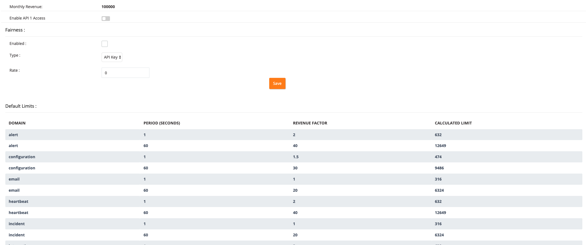

# Rate limiting

Rate limits protect the platform and ensure that we can meet our availability and latency objectives for all consumers (we don’t want a single consumer to degrade the service for others consumers). When we increase rate limits we ensure that there is sufficient capacity / buffer for organic growth and peak demand and we do this with consideration to all other consumers.

## Rate limit policy

Rate limits are applied per the client’s IP address or on asap issuer level (service-to-service authentication). The rate limit thresholds are configured on a rate limit window (for instance 60 seconds, but it may vary - see OpsGenie architecture).

## Rate limit response headers

The following HTTP response headers are returned indicating the rate and threshold allowed for a client, for each requests to an API which is rate limit protected:

- **X-RateLimit-Key**: Indicates the key which is used for rate limiting.
- **X-RateLimit-Limit**: Rate limit threshold.
- **X-RateLimit-Remaining**: No. of remaining requests possible.
- **X-RateLimit-Reset**: Remaining time before the rate limit counter resets.

## Client Breaching rate limit thresholds

When a client breach the rate limit thresholds, they get `HTTP 429 Too Many Requests` responses. The client has to wait for the rate limit counter to reset on the server before being able to make successful requests.

## Use case: OpsGenie

The followings are the characteristics of the rate limiting on Opsgenie Gateway layers:

- **Token-bucket algorithm** is applied,

- Requests are counted on a **Redis cluster (AWS Elasticache)** which is dedicated for rate limiting. The memory policies of the Redis cluster is configured according to the rate-limiting specific requirements, where network calls for item expiration are prevented with the combination of memory upper-bound and LRU expiration policies.

- Default rate limits are calculated according to the MRR of the tenants: The more a tenant pays for their Opsgenie subscription, the higher request limits they have.

- Opsgenie provides lots of different APIs that hits different services and data-flows, that have different architectural constraints, costs or bottlenecks. Therefore, Opsgenie categorizes different APIs (+ Email processing) under the concept of **rate limiting domains**, where default domains have different default request limits and rate limiting/throttling is applied to them separately. While a tenant is being throttled for a request that hits Domain A, the same tenant may not be throttled for another request at the same time that hits Domain B. The current list of the rate-limiting domains are incident, alert, integration, heartbeat, configuration, email, schedule-on-call and search. As an example, the request limits of the alert domain are 40 times higher than the request limits of schedule-on-call domain due to the computing and network cost of the API endpoints that schedule-on-call domain has.

- By default, rate limits are applied separately for the periods of **1 second and 1 minute**.

- Opsgenie supports **per-tenant override policies** for rate limiting. Opsgenie nightwatch responders and customer support members are able to define override policies via Opsgenie Administration Panel, that supports the following:

  - Override the calculated request limit of a domain for a specific rate-limiting period,

  - Define a new rate limiting period and request limit (e.g. 15 minutes, 1 hour, 1 month, …) for a rate limiting domain,

  - Define an expiration time for a new / existing override policy

- In case a customer asks, **intra-tenant fairness** can be enabled for a tenant to be applied as either per-team or per-API Token. By this way, a tenant is able to configure their rate limits so that any of their teams or API tokens can not consume more than X% of the request limits they have, on any time.

- No matter how many different periods will be checked or whether intra-tenant fairness is enabled or not, there should be at most 1 network call for request counting.

Kadir: *"I've written large sections for Opsgenie Gateways and rate limiting, because we believe that having lightweight gateway layers with powerful rate limiting capabilities is crucial to have higher availability, reliability and performance."*
