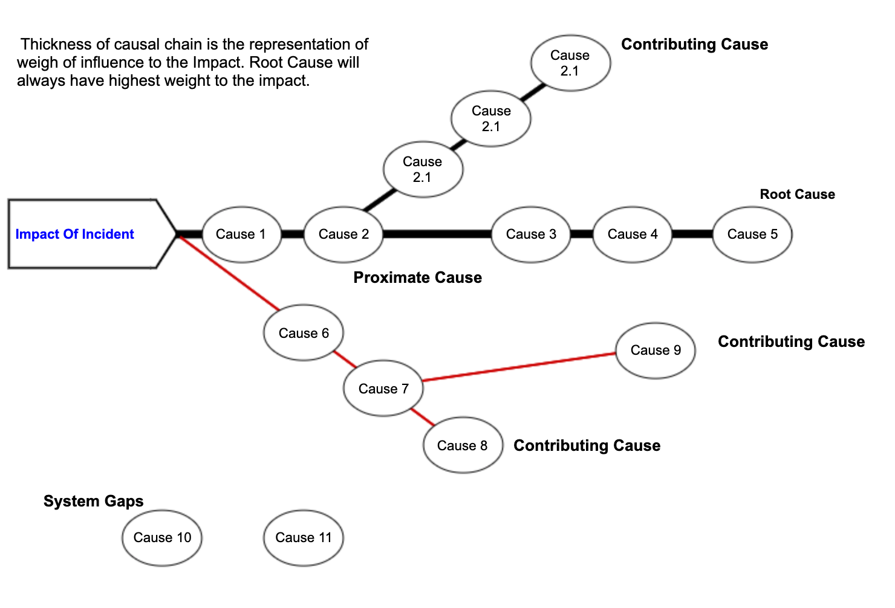

# Incident management

## Introduction

Let's formalise what qualifies an incident:

"An existing or inpending intentional negative impact on Confidentiality, Integrity or Availability of either Customer Data, Company Data or Company Services."

> Why dealing with incidents using a standardised manner?

To reduce the time to recovery (TTR) of incidents via standardising and scaling our response to them.

## Incident Process

- File an HOT ticket:
  - can be done manually or automatically (i.e. following an alert),
  - there shall be an associated conference room
- Determine if incident is **major** or **minor**:
  - if minor, shall be handled directly and PIR isn't mandatory
  - if major, **wait** that an Incident Manager (IM) acknowledges it (usually within 15 min)
  - if major, a PIR ticket **must be created** upon completion
- Diagnose incident severity:
  - SEV0 to SEV2 are major incidents:  
    - SEV0 is crisis
    - SEV1 is critical
    - SEV2 is important
    - consider HOT ticket's severity as "peak" severity:
      - peak severity shouldn't be downgraded once impact has been mitigated,
      - however can be handled as lower severity afterwards
  - SEV3 is for all minor incidents
  - check severity matrix and study:
    - total service outage
    - is service degraded?
    - is there data loss?
    - how many customers are affected?
    - how many support tickets are raised?
- Incident can be resolved once business impact has been mitigated (discuss creation of a PIR)
- Note: cleanup outside impact window isn't part of the incident

## On-Call Process

- Rotating on-call roasters
- Person being paged is the "First Responder":
  - closes the Page and comes online within 15 minutes
  - determines if page is an incident
  - determines incident severity:
    - if minor, can be handled immediately or during business hours
  - creates the incident
  - collaborates with the Incident Manager in case of a major incident
- note: the Incident Manage can page subsequent teams called "Escalation Responders"

## Communication channels

| Channel                         | Notes                                                                                |
|---------------------------------|--------------------------------------------------------------------------------------|
| HOT Ticket                      | Mandatory, source of truth for incident state and severity                           |
| Slack Channel                   | Recommended for realtime detailed comms                                              |
| Zoom War Room                   | May be required for quick attendance                                                 |
| Physical War Room               | May be required for major incidents                                                  |
| Incident State Document (ISD)   | Utilised in laterally affecting incidents to keep on top of multiple streams of work |
| Internal Statuspage             | Mandatory for major incidents, mainly internal and 3rd party systems                 |
| Internal Management Team Comms  | Mandatory for major incidents                                                        |
| External Comms, Support Tickets | Recommended                                                                          |
| External Statuspage             | Recommended                                                                          |
| External Comms, Legal/Marketing | For public communications and/or bulk emails to affected customers                   |

## Post Incident Review (PIR)

This process can be run by a "PIR Owner" to:

- mitigate the reoccurence of an incident
- extract some learnings from an incident
- answer "are we doing enough for our customers?"

> Which differences between a PIR and PIR-X (lightweight) ?

| PIR               | PIR-X (lightweight)         |
|-------------------|-----------------------------|
| For SEV0 and SEV1 | For SEV2 and SEV3           |
| requires meeting  | simpler and more autonomous |
| needs training    | no need for training        |

> What kind of outcome does a PIR provides?

| Left: Priority actions                 | Right: Improvement actions             |
|----------------------------------------|----------------------------------------|
| Tactical/short-term actions            | Strategic/long-term actions            |
| Mitigate reoccurence of incident       | could be unrelated/system improvements |
| classify into low/medium/high priority |                                        |
| evaluate risk cost matrix              |                                        |
| example: _augment service capacity_    | example: _implement rate limiting_     |

### PIR-X (lightweight process)

Creation of a PIR ticket:

- first summarize: incident summary, impact, ...
- for other than SEV3, complete "five whys" (see next section)
- list corrective action items
- have team validate your draft

### The "Five Whys" Technique

Characteristics of Incidents:

- Incidents are inevitable
- Not all incidents are deterministic
- A **deterministic** incident can have the following categories of contributors:
  - **Root Cause(s)** (RC): Mostly one dominant thing which directly contributes to the incident. When it is non-existent, the incident would not have happened. Occasionally you may find more than one RCs.
  - **Contributing Cause(s)** (CC) - Things which have either aggravated the Root Cause or contributed explicitly to the incident.
  - **System Gap(s)** (SG) - Things which have not contributed to the incident at all but are identified as risk or gap which may cause or contribute to different incidents in the future. They are gaps in the system and risks due to human factors.
- A **non-deterministic** incident can have the following variations:
  - series of events and cause of events can’t be explained,
  - root Cause is unknown i.e. there is not enough information available to analyse the RC,
  - you can still have Contributing Causes (CCs) and System Gaps (SGs) which can produce some actions items

An Incident can be mapped over a **Causal Graph** having multiple causal chains. A straightforward incident may have a linear causal chain with a few or no branches.

Regarding the "Five Whys":

- Five Why is a metaphorical term i.e. You can have less or more questions than Five
- There will be more than one Five Whys for a PIR
- There will be one (Occasionally more) Five Whys pointing to the Root Cause(s)
- There can be one or more Five Why pointing to the Contributing Cause(s)
- There can be one or more Five Why pointing to the System Gap(s)
- One Five Why can result in multiple Action items (Priority/Improvements) OR No Actions (Learnings)
- Five Whys analysis focuses on finding the causes (problems at the core) and not the solutions itself

How to proceed:

- **Start backward**: start asking the question from ‘Impact of the Incident’ and work backward until you see the opportunities/problems (which can have actions),
- **Traverse backward**: the subsequent questions of Five Why should unravel the events/actions in the reverse order,
- **Outcome**: last two question of a Five Why should lead you to tangible Action Item(s) or a Learning(s),
- **Dead End**: if a Five Whys is hitting roadblock (i.e. not resulting into tangible outcome), Revisit the questions, there is something wrong in the questions asked,
- **When to Stop asking Why?** Review the Five Whys and see if it makes sense to go down further to get more concrete actions? Review the Last two questions and see if they offer proximate cause (symptom) or true cause (core reason),
- **System Gaps**: you may find some improvements/gaps in the system which has nothing to do with the incident causes but they can result in other abnormalities. Look for those avenues and record them as Improvement Actions,
- **"Contribution Causes" Field**: we have a text field for Root Cause in PIR Draft, however, we don’t have a field for Contributing Causes (CCs). Please covert the CCs into action items and put them directly under the Corrective Actions until we fix the draft. The same recommendation applies to System Gaps.

> Having Multiple Root Causes?

There could be incidents where you may experience more than one dominant causes impacting the incident. In these incidents, You may fall on one of the following scenarios:

- Those individual cases in isolation can result in the incident  - Presence of any one of the cause have resulted in the incident. Choose all the causes as RCs,
- Those causes have collectively resulted in in the incident - the Combined presence of all of the cause have resulted in the incident. Choose all the causes as RCs,
- Those causes are overlapping - The causes are closely related and interdependent. Review the  Causes collectively and see if they can be merged into one meaningful Root Cause.

> Unknown Root Cause?

As said earlier, Not all incidents are deterministic, you may encounter an incident which doesn't have good enough data to bind the series of events and understand the phenomenon. Five Whys for these incidents will lead to the roadblock and you wouldn’t be able to derive the concrete action items. Don’t worry. Likely of this category of incidents are less but if they happen, Please record priority actions to improve the observability of alerting and monitoring systems so if this incident repeats again in future, you have got a path to investigate.

### Drafting the PIR

- Fill up a **Timeline** field first in the PIR draft. Timelines give a deep understanding of a series of events and eventualities which further ease the write up for the other fields. Express dates in UTC 24 hours format.
- Once Timeline is drafted, fill up **Incident Summary, Lead-Up, Fault, Impact, Detection, Response, Recovery fields**
- Identify all incident-related impact and issues and work backward from them to develop Five-Whys.
- Fill in the Root Cause(s).
- Five Whys should generate Action Items and Learnings. Fill the potential action items in Corrective Actions field and learnings in Lesson Learnt
- Apply labels on the PIR.
