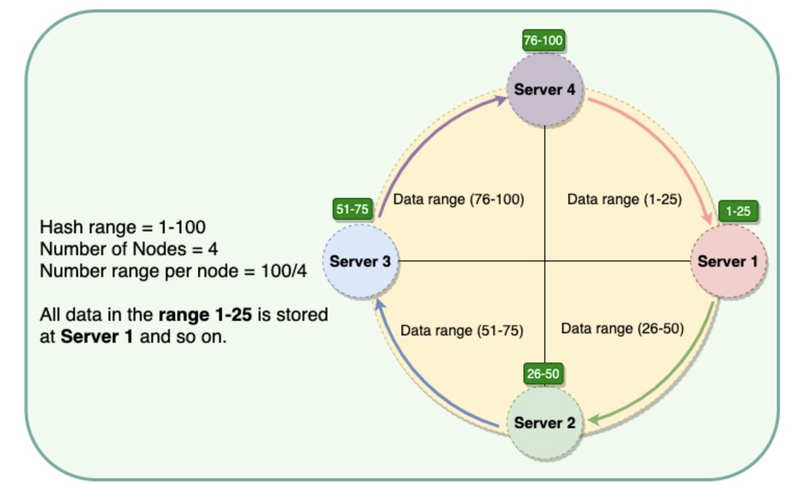

# Consistent Hashing

Distributed systems can use Consistent Hashing to distribute data across nodes. Consistent Hashing maps data to physical nodes and ensures that only a small set of keys move when servers are added or removed.

Consistent Hashing stores the data managed by a distributed system in a ring. Each node in the ring is assigned a range of data. Here is an example of the consistent hash ring:

With consistent hashing, the ring is divided into smaller, predefined ranges. Each node is assigned one of these ranges. The start of the range is called a token. This means that each node will be assigned one token. The range assigned to each node is computed as follows:

__Range start__: Token value

__Range end__:  Next token value - 1

Whenever the system needs to read or write data, the first step it performs is to apply the __MD5 hashing algorithm__ to the key. The output of this hashing algorithm determines within which range the data lies and hence, on which node the data will be stored. As we saw above, each node is supposed to store data for a fixed range. Thus, the hash generated from the key tells us the node where the data will be stored.

The Consistent Hashing scheme described above works great when a node is added or removed from the ring, as in these cases, since only the next node is affected. For example, when a node is removed, the next node becomes responsible for all of the keys stored on the outgoing node. However, this scheme can result in non-uniform data and load distribution. This problem can be solved with the help of Virtual nodes.

## Virtual Nodes

Adding and removing nodes in any distributed system is quite common. Existing nodes can die and may need to be decommissioned. Similarly, new nodes may be added to an existing cluster to meet growing demands. To efficiently handle these scenarios, Consistent Hashing makes use of virtual nodes (or Vnodes).

As we saw above, the basic Consistent Hashing algorithm assigns a single token (or a consecutive hash range) to each physical node. This was a static division of ranges that requires calculating tokens based on a given number of nodes. This scheme made adding or replacing a node an expensive operation, as, in this case, we would like to rebalance and distribute the data to all other nodes, resulting in moving a lot of data. Here are a few potential issues associated with a manual and fixed division of the ranges:

- __Adding or removing nodes__: Adding or removing nodes will result in recomputing the tokens causing a significant administrative overhead for a large cluster.
- __Hotspots__: Since each node is assigned one large range, if the data is not evenly distributed, some nodes can become hotspots.
- __Node rebuilding__: Since each node's data might be replicated (for fault-tolerance) on a fixed number of other nodes, when we need to rebuild a node, only its replica nodes can provide the data. This puts a lot of pressure on the replica nodes and can lead to service degradation.

To handle these issues, Consistent Hashing introduces a new scheme of distributing the tokens to physical nodes. Instead of assigning a single token to a node, the hash range is divided into multiple smaller ranges, and each physical node is assigned several of these smaller ranges. Each of these subranges is considered a Vnode. With Vnodes, instead of a node being responsible for just one token, it is responsible __for many tokens (or subranges)__.

Practically, Vnodes are randomly distributed across the cluster and are generally non-contiguous so that no two neighboring Vnodes are assigned to the same physical node or rack. Also, since there can be heterogeneous machines in the clusters, some servers might hold more Vnodes than others.

Vnodes gives the following advantages:

- As Vnodes help spread the load more evenly across the physical nodes on the cluster by dividing the hash ranges into smaller subranges, this __speeds up the rebalancing process after adding or removing nodes__. When a new node is added, it receives many Vnodes from the existing nodes to maintain a balanced cluster. Similarly, when a node needs to be rebuilt, instead of getting data from a fixed number of replicas, many nodes participate in the rebuild process.
- Vnodes make it __easier to maintain a cluster containing heterogeneous machines__. This means, with Vnodes, we can assign a high number of sub-ranges to a powerful server and a lower number of sub-ranges to a less powerful server.
- In contrast to one big range, since Vnodes help assign smaller ranges to each physical node, this __decreases the probability of hotspots.__

## Data replication using Consistent Hashing

To ensure highly available and durability, Consistent Hashing replicates each data item on multiple N nodes in the system where the value N is equivalent to the replication factor.

The replication factor is the number of nodes that will receive the copy of the same data. For example, a replication factor of two means there are two copies of each data item, where each copy is stored on a different node.

Each key is assigned to a coordinator node (generally the first node that falls in the hash range), which first stores the data locally and then replicates it to N-1N−1 clockwise successor nodes on the ring. This results in each node owning the region on the ring between it and its NthNth predecessor. In an eventually consistent system, this replication is done asynchronously (in the background).