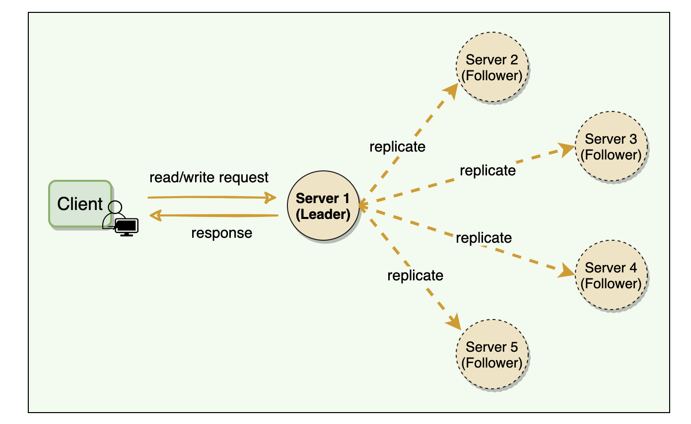

# Quorum

In Distributed Systems, data is replicated across multiple servers for fault tolerance and high availability. Once a system decides to maintain multiple copies of data, another problem arises: how to make sure that all replicas are consistent, i.e., if they all have the latest copy of the data and that all clients see the same view of the data?

In a distributed environment, a quorum is the minimum number of servers on which a distributed operation needs to be performed successfully before declaring the operation's overall success.

Suppose a database is replicated on five machines. In that case, quorum refers to the minimum number of machines that perform the same action (commit or abort) for a given transaction in order to decide the final operation for that transaction. So, in a set of 5 machines, three machines form the majority quorum, and if they agree, we will commit that operation. Quorum enforces the consistency requirement needed for distributed operations.

In systems with multiple replicas, there is a possibility that the user reads inconsistent data. For example, when there are three replicas, `R1`, `R2`, and `R3` in a cluster, and a user writes value v1 to replica `R1`. Then another user reads from replica `R2` or `R3` which are still behind `R1` and thus will not have the value v1, so the second user will not get the consistent state of data.

__What value should we choose for a quorum?__ More than half of the number of nodes in the cluster: `(N/2 + 1)` where `N` is the total number of nodes in the cluster, for example:

- In a 5-node cluster, three nodes must be online to have a majority.

- In a 4-node cluster, three nodes must be online to have a majority.

- With 5-node, the system can afford two node failures, whereas, with 4-node, it can afford only one node failure. Because of this logic, it is recommended to always have an odd number of total nodes in the cluster.

Quorum is achieved when nodes follow the below protocol: `R + W > N`, where:

- `N` = nodes in the quorum group

- `W` = minimum write nodes

- `R` = minimum read nodes

If a distributed system follows `R + W > N` rule, then every read will see at least one copy of the latest value written. For example, a common configuration could be `(N=3, W=2, R=2)` to ensure strong consistency. Here are a couple of other examples:

- `(N=3, W=1, R=3)`: fast write, slow read, not very durable

- `(N=3, W=3, R=1)`: slow write, fast read, durable

The following two things should be kept in mind before deciding read/write quorum:

- `R=1` and `W=N` => full replication (write-all, read-one): undesirable when servers can be unavailable because writes are not guaranteed to complete.

- Best performance (throughput/availability) when `1 < r < w < n`, because reads are more frequent than writes in most applications.

## Caveat

However, using quorum can lead to another problem, that is, lower availability; at any time, the system needs to ensure that at least a majority of replicas are up and available, otherwise the operation will fail. Quorum is also not sufficient, as in certain failure scenarios, the client can still see inconsistent data.

## Solution

Allow only a single server (called leader) to be responsible for data replication and to coordinate work.

At any time, one server is elected as the leader. This leader becomes responsible for data replication and can act as the central point for all coordination. The followers only accept writes from the leader and serve as a backup. In case the leader fails, one of the followers can become the leader. In some cases, the follower can serve read requests for load balancing.

