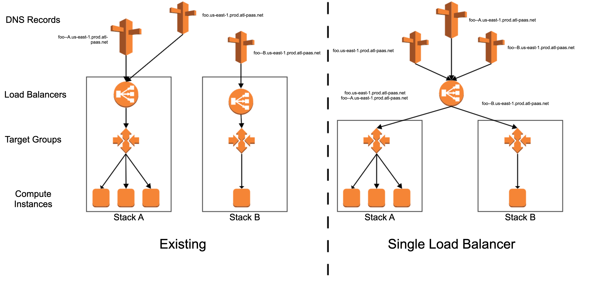
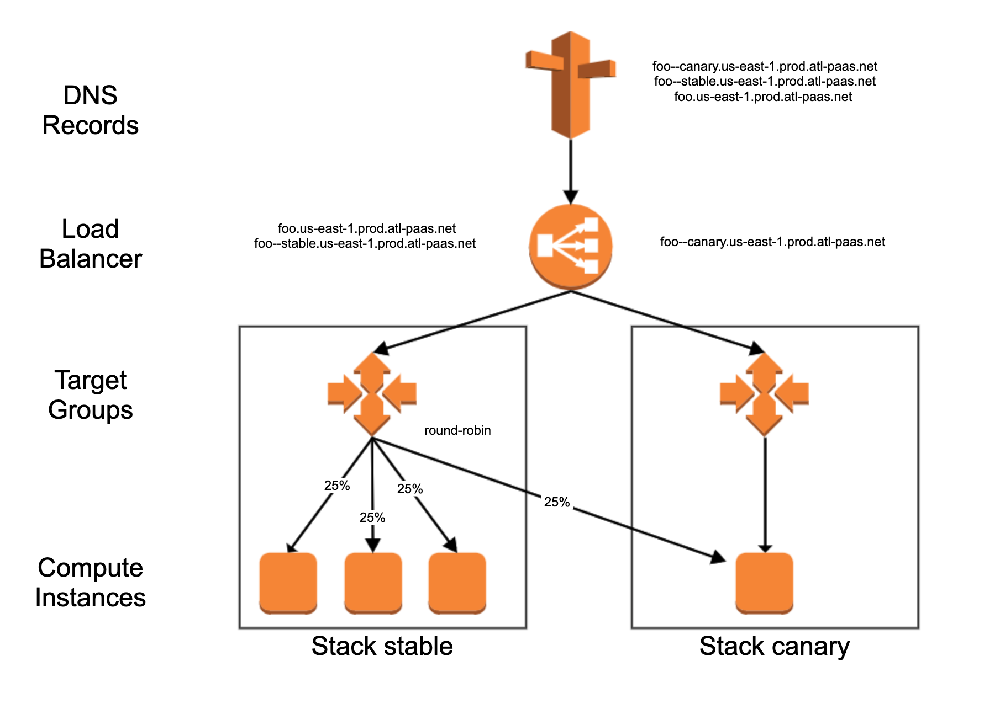

# Progressive rollout

Server-side progressive rollout can be achieved using a single application load balancer.

## Single load balancers

In Micros (Atlassian), we currently create a new load balancer for each deployment and update DNS records to point at the new load balancer. Single Load balancers are our way of using one load balancer per service per environment by utilizing hostname routing on the load balancer:



Benefits

- Load balancers are now warm for every deployment,
- We can run server side progressive rollouts (see below),
- Deployments are up to 4 minutes faster and rollbacks now take seconds.

> Your load balancer metrics and logs will now be split by target group rather than by load balancer so you may have to change some dashboards/alerts.

### Moving subnets

If you want to change the `ingress` controls for your load balancer, controlled by the network, you will need to 'rotate' your load balancer as it is a non-zero time upgrade. The steps to achieve this are:

- Deploy a new version of your service with `single: false`,
- Remove your existing single load balancer from the environment (`micros service:lb:remove <service> -e <environment>`)
This will undeploy the load balancer and allow you to deploy a new one in a new group of subnets.

- Deploy your new configuration with `single: true`.

## Progressive rollouts



> Services using Progressive Rollout deployments can take advantage of Automated Anomaly Detection

### Initial deploy

The auto-scaling group min/desired is overridden for progressive rollouts to be max(1, currentDesired * initial traffic).

If there is a 0% initial request we still want at least one node in the ASG because we cannot validate a healthy deploy otherwise however we don't attach the canary ASG to the stable target group so there is no traffic going to the canary stack.

### Rollforward

We make a best effort percentage rollout, if there are only 3 nodes in your normal deployment the traffic percentage can only ever be 0, 25, 40, 50, 100 percent increments. This is because we don't want to scale down the primary stack in case a rollback is required at any point during the rollout.

Scaling rules are still active during a rollout so the rollout could be affected by scaling occuring just like in the current progressive rollout. However we pin the stable stack to at least the number of nodes it had at the beginning of the rollout to reduce this impact.

```bash
// How the canary desired is calculated
upperBound = min(canaryMax, max(stableDesired, originalCanaryMin)
lowerBound = currentDesired
canaryDesired = traffic >= 100 ? stableDesired : Math.round(stableDesired * traffic / (100 - traffic)
finalDesired = min(upperBound, max(lowerBound, canaryDesired))
```

> You should never specify a percentage between 50 and 100, and if you do, it will not work. This is because we achieve the canary traffic by adding new nodes to the existing nodes. To get a percentage over 50 to your canary, we would either need to kill existing stable nodes, or add more nodes to the canary than exist in the stable (which would then promptly be killed once the rollout was finished). Using a value between 50 and 100 will lead to unexpected behavior.

### Final rollforward

We set the canary as the primary with the listener rules and remove it from the target group. We also restore the ASG to it's original min config unless it has been changed elsewhere (through service:scale for example).
