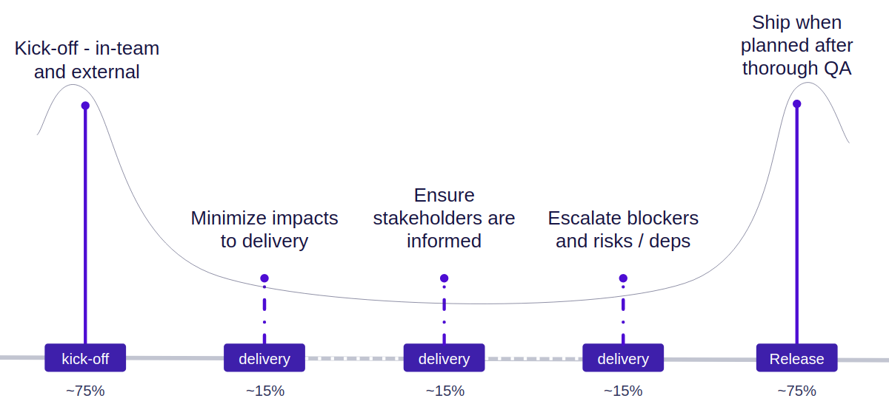

# Feature leading

## Where does my time even go? Are there expectations?

The way day-to-day feature leading responsibilities are normally categorised is minimising impacts to delivery, ensuring stakeholders are informed, and escalating blockers, risks, and dependencies (especially changing/new ones).

During a feature delivery these activities tend to not take most of your time, but they often don't come in a predictable manner, meaning you can find yourself frequently disrupted for short bursts, making your days much less efficient than they may be normally.

### The book-ends (kick-off & delivering)

Unlike the delivery part of the project where a routine can be built and you may find yourself contributing regularly to normal activities like coding you'll struggle to do any of this.

Kick-off takes investment to be done successfully. You'll need to be wrangling stakeholders, dependencies, and getting to grips with the risks you can foresee.

The final stages of delivery are no different in this aspect - you'll need to dedicate yourself to supporting your feature team - ensuring there's sufficient QA, tests are covered, build pipelines are green. They're small on there own, but add up really fast.

## Recommended playbooks

### Feature Kick-Off

You may have sat through many feature kick-offs in the past, but running one is a very different experience to taking part in one. Leverage this playbook to help everyone involved get a shared understanding of the features scope.

[Playbook](https://www.atlassian.com/team-playbook/plays/feature-kick-off)

### Goals, Signals, and Measures

Did you ask "why"? As a team, sit down and set clear goals, define signals, and what measures you'll use to know when you're done. This makes sure you can focus on your endgame. :ironman:

[Playbook](https://www.atlassian.com/team-playbook/plays/goals-signals-measures)

### Stand-up Meetings

Similar to feature kick-off, running is more complex than attending. Having a stand-up that the feature team get value from and doesn't last a long time is a delicate balance. Using the playbook's steps will help manage this.

[Playbook](https://www.atlassian.com/team-playbook/plays/standups)

### DACI

It's quite likely you'll hit difficult or complex decisions - especially during larger features. The DACI framework helps you make group decisions efficiently and effectively.

[Playbook](https://www.atlassian.com/team-playbook/plays/daci)

### Retrospectives

Again, just like stand-ups and kick-offs. Retros are much better when facilitated properly with a clear timeline of events and actionable outcomes. The playbook is a great tool, especially when used in conjunction with BetterRetros - fostering open feedback through pseudo-anonymity

[Playbook](https://www.atlassian.com/team-playbook/plays/retrospective)

## Project Team Health Monitor

Not many single features will be around long enough to warrant having a feature team health monitor as it's generally used for longer-standing teams. That being said, if you find you're owning a feature for many quarters then having a monthly or bi-monthly health monitor to make sure you're functioning as effectively as possible.

[Playbook](https://www.atlassian.com/team-playbook/health-monitor/service-teams)
