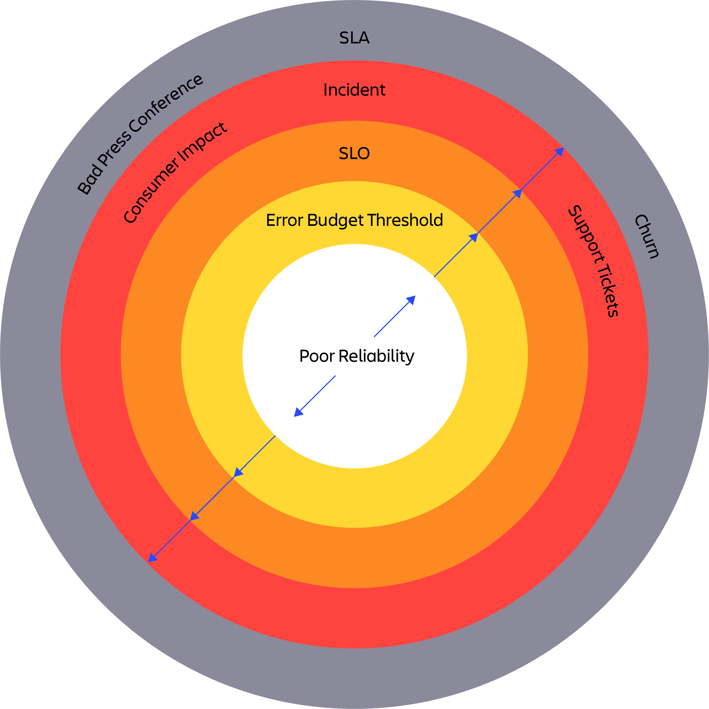
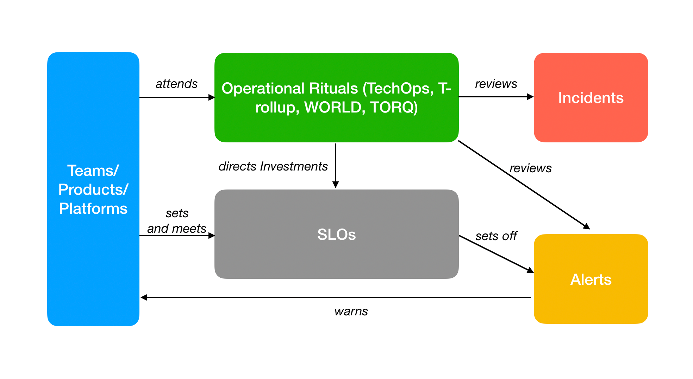

# Cloud SLA

## Intro

For cloud reliability, the industry standards set SLOs and Error Budgets for product’s capabilities to get more points where teams are notified of a degradation:

Of course, having SLOs and Error Budgets are not enough. We need best practices, good tooling and operational rituals to get the best out of our SLOs:

## Definitions

### SLI

- 2 signal flow queries as input: one for “good” events, the other for “bad” events,
- measured as a percentage of good/total events,
- per-minute datapoints for each good and bad query retrieved daily,
- Latest 28 day SLI

_To be continued..._

